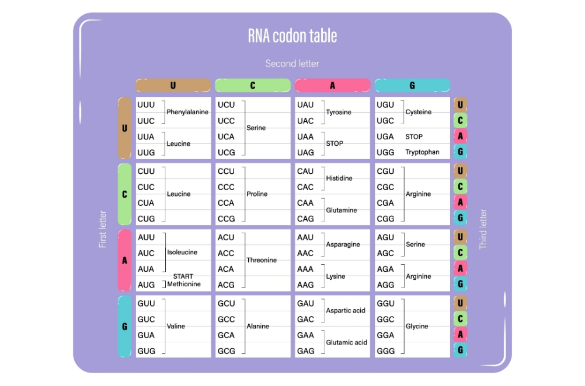

# RNA to Protein Translator (Functions Version)

Python script that translates an RNA sequence into a protein sequence using the genetic codon table. The program first cleans the RNA sequence and then translates it into amino acids by reading codons (groups of 3 bases). It follows real biological rules by starting translation from the start codon (AUG) and stopping at stop codons (UAA, UAG, UGA). A dictionary is used to map codons to their corresponding amino acids, making the program more efficient and scalable compared to using multiple conditional statements.

## What I Learned
  
- How to use dictionaries to map codons to amino acids  
- How to create reusable functions for sequence processing  
- How to use loops with step size (3) for codon reading  
- How to use slicing (`i:i+3`) to extract codons  
- How to handle incomplete codons safely  
- How to combine biology concepts with programming logic  
- How default parameters work in functions  

## Reference

This project uses the standard genetic codon table for translation.

This image shows how each RNA codon corresponds to a specific amino acid.
